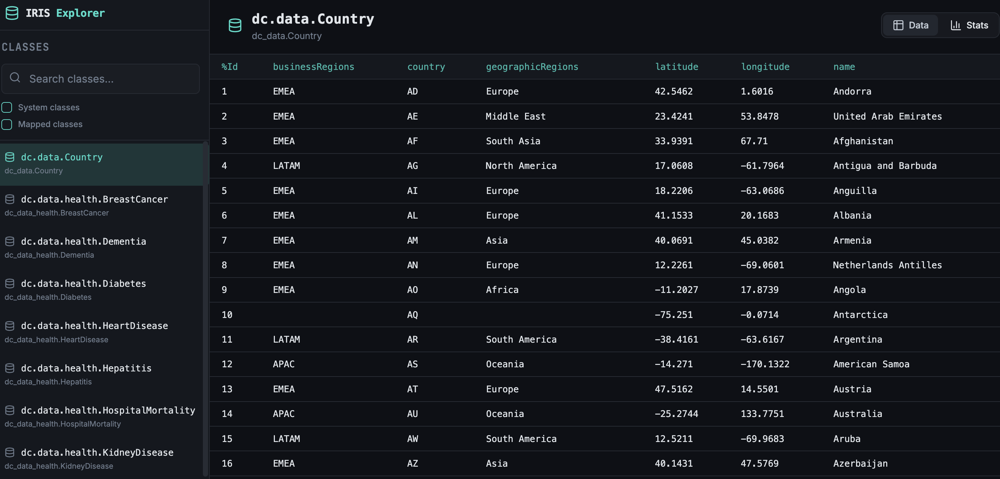

# IRIS Class Explorer UI

`iris-class-explorer` is a frontend UI for the backend project [`iris-table-stats`](https://github.com/evshvarov/iris-table-stats).

The UI was vibecoded in Lovable, then adapted to work as an IPM-installable IRIS web module. The result is a browser-based explorer for persistent classes, table data, and column population statistics running directly inside InterSystems IRIS.

## What it does

This UI connects to the `iris-table-stats` backend API and provides:

- a searchable list of persistent classes
- optional inclusion of system classes and mapped classes
- a data tab to browse rows from a selected class
- pagination for class data browsing
- a stats tab to inspect column population percentages, populated counts, and empty counts
- a configurable backend API URL stored in browser local storage

## Screenshots

### Data view



### Stats view


By default, the UI expects the backend API at:

```text
/iris-table-stats/api
```

## Install with IPM

If the package is available in your registry, install it with:

```objectscript
zpm "install iris-table-stats-frontend"
```

The module installs the frontend as an IRIS web application at:

```text
/iris-table-stats-ui
```

## Local build and container flow

- `npm run build` compiles the frontend into `dist/`
- `docker compose build` builds the frontend first, then copies `dist/` into the IRIS image
- IPM creates the IRIS web application and deploys the compiled frontend files into the CSP directory

Once running, open:

```text
http://localhost:52773/iris-table-stats-ui/
```

## Development notes

This repo contains the frontend packaging pattern for IRIS/IPM:

- Vite production assets are built under `dist/`
- the app is configured to run under a non-root base path
- React Router handles both `/iris-table-stats-ui/` and `/iris-table-stats-ui/index.html`
- `module.xml` uses `WebApplication` and `FileCopy` so the bundle is installed as an IRIS web app

If you want the reusable agent workflow for doing this to another frontend app, see [codex-ipm-frontend-module-runbook.md](/Users/eshvarov/Github/iris-class-explorer/codex-ipm-frontend-module-runbook.md).

## Fork and contribute

Fork it. Use it as a template for your own IRIS frontend modules. Improve it and send a pull request.

Useful contributions include:

- UI and UX improvements
- more views over backend metadata
- better filtering and navigation
- support for more backend endpoints from `iris-table-stats`
- packaging refinements for IRIS/IPM deployment
